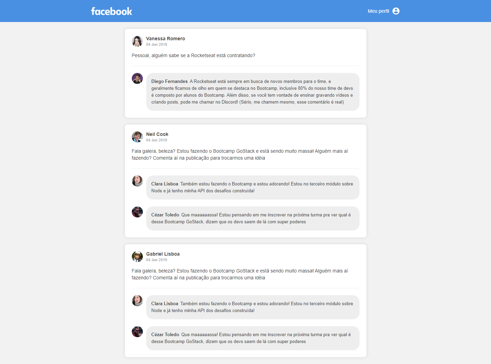

<h1 align="center">
 
Rocketseat - GoStack 10 - Challenge 04
</h1>

This project was created to solve a challenge requested by Rocketseat. 
Gostack is immersive training in technologies, react and react natively.

  

  

## Features

- This project does not have features implemented, just layout.

- ⚛️ **React Js** — A JavaScript library for building user interfaces

## Getting started

- Clone project > enter the project folder
- run `yarn`
- run `yarn dev`

## License

This project is licensed under the MIT License - see the [LICENSE](https://opensource.org/licenses/MIT) page for details.

---

Created with passion by me 👨🏻‍💻
